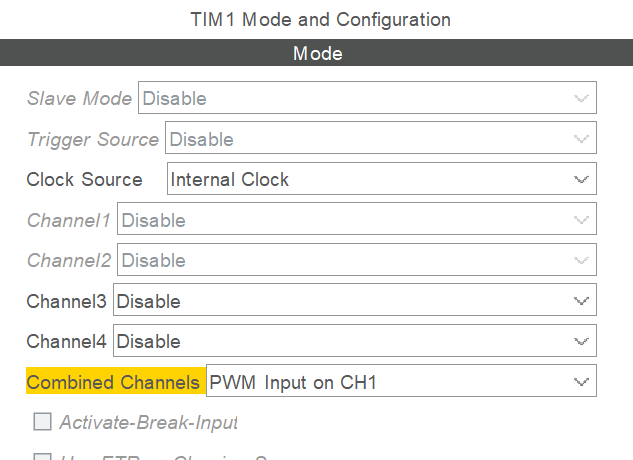

# HCSR04 Driver for HAL
这是为HAL库编写的HCSR04驱动，可以在任何集成有 **带有输入捕获** 和 **复位从模式** 的 **通用定时器**  的 **支持HAL库** 的 STM32 MCU 上使用。
## 文件结构
整个仓库是一个基于STM32F401RCT6的使用例程(IDE 为 MDK-ARM)，HCSR04文件夹中的两个文件（hcsr04.h hcsr04.c）是HCSR04的驱动库文件.
## 如何使用
* 首先在STM32CubeMX中新建工程，按需配置通用定时器的时钟源。
* 对于较新版本的STM32CubeMX，配置 **Combined Channels** 为 **PWM Input on CH1** ，并启用输入捕获中断

* 对于旧版本，配置从模式为复位模式，触发源TI1FP1，CH1 CH2 分别为 ic direct（上升沿）、 ic indirect（下降沿），并启用捕获中断
* 启用一个推挽输出的 GPIO 引脚

* 在 **HAL_TIM_IC_CaptureCallback** 中调用 **hcsr04_ic_handler**
```C
void HAL_TIM_IC_CaptureCallback(TIM_HandleTypeDef *htim)
{
	hcsr04_ic_handler(htim);
}
```
* 在 **外设初始化之后** 调用 **hcsr04_init**，该函数声明于头文件 *hcsr04.h*
* 调用 **hcsr04_triger** 启动测量
* 通过 **hcsr04_read** 读出捕获结果
* 通过 **hcsr04_updated** 检查上次读取后数据是否有更新
* 通过 **float hcsr04_get_cm** 获得换算的结果（单位 cm，传入参数为经过所有分频后的定时器时钟频率，基于20摄氏度下的声速计算）
* 还提供了 **阻塞等待读取** 和 **基于SysTick的微秒级延时**（受到SysTick分频影响，按无分频计算延时，如果使用8分屏，需要稍作修改，如果延时函数被长时间或者频繁打断，将带来较大误差）的函数，请自行 **RTFSC**
```C
/* Initialize all configured peripherals */
  MX_GPIO_Init();
  MX_TIM1_Init();
  /* USER CODE BEGIN 2 */

  /* USER CODE END 2 */

  /* Infinite loop */
  /* USER CODE BEGIN WHILE */
	
  hcsr04_init(&htim1, GPIOA, GPIO_PIN_9, 1);
  while (1)
  {
		hcsr04_triger();
        // Any code here
        volatile uint32_t data = hcsr04_read();
		volatile float data = hcsr04_get_cm(1000000 /* Freq that used to caculate distance*/);
		
    /* USER CODE END WHILE */

    /* USER CODE BEGIN 3 */
  }
  /* USER CODE END 3 */
```